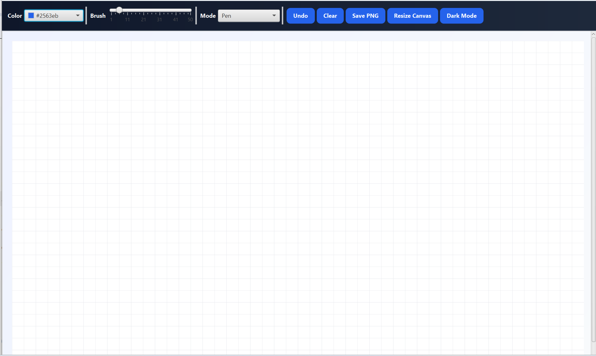

# 🎨 AdvanceDrawing

A modern JavaFX drawing application featuring dynamic canvas resizing, customizable brush tools, dark mode support, and image export capabilities.


---

## 📖 Overview

AdvanceDrawing is a desktop drawing application developed using JavaFX. It provides an interactive canvas environment where users can draw, customize brush settings, switch themes, and export their artwork.

This project was developed as part of the Computer Engineering curriculum at Amirkabir University of Technology (Tehran Polytechnic).

---

## ✨ Features

* 🎨 Color Picker
* 🖌 Adjustable Brush Size
* ✏ Multiple Drawing Modes
* ↩ Undo Functionality
* 🧹 Clear Canvas
* 💾 Export Drawing as PNG
* 📏 Dynamic Canvas Resizing
* 🌙 Dark Mode Support
* 🖥 Responsive JavaFX Interface
* 📐 Grid-Based Drawing Surface

---

## 📷 Screenshot

> Add your screenshot here

```md

```

---

## 🏗 Technologies Used

* Java 17
* JavaFX
* Maven
* Object-Oriented Programming (OOP)
* Canvas API
* Event Handling

---

## 🚀 Getting Started

### Prerequisites

Install:

* Java JDK 17+
* Maven 3.9+

Verify installation:

```bash
java --version
mvn --version
```

### Clone Repository

```bash
git clone https://github.com/Wadan3/AdvanceDrawing.git
cd AdvanceDrawing
```

### Run Application

```bash
mvn clean javafx:run
```

---

## 📂 Project Structure

```text
src/
└── main/
    ├── java/
    │   └── com/example/javafxtest/
    │       ├── ShapeDrawingApp.java
    │       └── ShapeDrawingAppController.java
    └── resources/
```

---

## 🧠 Key Concepts Demonstrated

* Object-Oriented Design
* JavaFX GUI Development
* Event-Driven Programming
* Canvas Graphics Rendering
* Dynamic UI Components
* Maven Project Management

---

## 🎓 Academic Project

This project was developed as a university project and demonstrates practical application of Java GUI development concepts using JavaFX.

---

## 📜 License

This project is licensed under the MIT License.

---

## 👨‍💻 Author

**Abdul Mosawer Wadan**

Computer Engineering Student
Amirkabir University of Technology

GitHub: https://github.com/Wadan3
